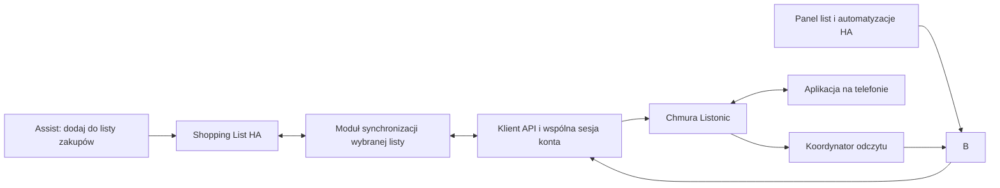

# Plan integracji Listonic z Home Assistant

Data aktualizacji: 2026-09-29. Projekt w trakcie wdrażania; status wykonania jest opisany w README.
Aktualizacja: test prawdziwego API potwierdził login, refresh i CRUD na dedykowanej
liście. W WSL przechodzi 149 testów z pokryciem 95,03%, w tym lifecycle HA,
dwukierunkowy bridge Shopping List, options flow, offline, konflikty i polskie
`conversation.process`. Osobny live test potwierdził pełny bridge z prawdziwym
API: Assist, zmiany w obie strony, zachowanie metadanych, reload i usuwanie.
Dodano CI Ruff/pytest i akcje list/metadanych, potwierdzone także live testem HA.
W WSL przeszły 2/2 Chromium E2E na rzeczywistym frontendzie HA z fake API: config flow,
Shopping List, polski Assist, zmiana z chmury i kolejka offline po reloadzie.
Test długotrwały, reauth przez UI i pełny restart procesu HA pozostają do
weryfikacji; żaden etap nie jest ukończony w pełnym zakresie.
Szczegóły: [dokumentacja API i raport](api/README.md).
Podstawa: [przegląd kodu i issues](integration-review.md),
[analiza API WWW](listonic-api.md).

## Cel i decyzje

Najważniejszy scenariusz: użytkownik wybiera w config flow listę Listonic,
która będzie powiązana z wbudowaną Shopping List HA. Następnie mówi do Assist
„dodaj mleko do listy zakupów”, a integracja synchronizuje produkt z wybraną
listą Listonic. Nie są potrzebne automatyzacje dla poszczególnych produktów.
Potwierdzenie wbudowanego Assist oznacza zapis lokalny w HA; stan synchronizacji
osobno wskazuje, czy zmiana dotarła do Listonic. Bezpośrednie operacje na encji
Listonic potwierdzają zapis do API.

1. Jedna natywna encja `todo` na każdą wybraną listę Listonic.
2. Jedna wybrana lista Listonic jest synchronizowana dwukierunkowo z wbudowaną
   shopping_list. Pozostałe listy są dostępne jako encje todo. Powiązanie jest
   częścią pierwszej wersji, zgodnie z decyzją użytkownika.
3. Własny asynchroniczny klient API, koordynator na konto, współdzielona sesja HA.
4. Domyślnie odczyt co 30 s i odświeżenie po zmianie; backoff przy awarii/429.
   To nasza decyzja, nie zadeklarowany limit API Listonic.
5. Krótka konfiguracja po polsku i angielsku; techniczne opcje poza główną ścieżką.
6. Najpierw weryfikacja sesji i poprawności zapisu, następnie pełna implementacja.

## Konfiguracja: trzy krótkie kroki

Wygląd jest oparty na natywnych formularzach HA. Jakość oznacza dobre opisy,
selektory, czytelne błędy i mało decyzji; nie osobny frontend zastępujący HA.

### 1. „Połącz z Listonic”

Opis: „Twoje listy zakupów w Home Assistant i Assist.”

- Email i zamaskowane hasło dla kont z hasłem Listonic; kontrola email przed HTTP.
- Postęp „Łączenie z kontem…” przy operacji sieciowej; przy błędzie zachowanie email.
- Oddzielne komunikaty: błędne dane, brak połączenia, limit API, niedostępny serwer.
- Sprawdzenie tożsamości konta i duplikatu integracji.
- Po udanym logowaniu zachować refresh token i DeviceId. Docelowo nie przechowywać
  hasła, jeśli test trwałości refresh potwierdzi samodzielne działanie sesji.

Konta Google: osobny etap weryfikacji metody logowania. Nie obiecywać prostego
„Zaloguj przez Google”, zanim nie potwierdzimy obsługi klienta/redirect i odnowienia
sesji. Własny projekt Google Cloud nie powinien być podstawowym onboardingiem.
Zaawansowany import sesji może być opcjonalnym obejściem, nie głównym UX.

### 2. „Wybierz swoje listy”

- Wielokrotny wybór po nazwach: np. „Dom”, „Drogeria”, „Weekend”.
- Przy identycznych nazwach czytelny dopisek identyfikujący listę/konto.
- Opcja „Automatycznie dodawaj nowe listy”, domyślnie wyłączona przy ręcznym wyborze.
- Puste konto: jasny komunikat oraz opcjonalne „Utwórz pierwszą listę”. Zapis
  wyłącznie po jawnym wybraniu tej czynności, nie jako test połączenia.
- Lista domyślna dla własnej akcji szybkiego dodawania; zawsze wskazywana przez ID,
  nigdy wyłącznie nazwę. Zmiana nazwy nie może zmieniać celu komend.

### 3. „Lista zakupów Home Assistant”

- Selektor „Którą listę połączyć z listą zakupów Home Assistant?” z nazwami
  list Listonic. Zapisać konto i list_id; zmiana nazwy nie zmienia powiązania.
- Opcja „Nie łącz” pozwala używać wyłącznie bezpośrednich encji todo.
- Opis: „Produkty dodane do listy zakupów w Home Assistant pojawią się na tej
  liście Listonic. Odhaczanie i usuwanie będą synchronizowane w obie strony.”
- Pokazać podsumowanie „Lista zakupów HA ↔ Dom (Listonic)” i komendę
  „Dodaj mleko do listy zakupów”.
- Jeśli shopping_list nie jest skonfigurowana, poprowadzić użytkownika przez jej
  natywną konfigurację i sprawdzić gotowość przed uruchomieniem synchronizacji.
- Przy pierwszym łączeniu pokazać sposób scalenia już istniejących zakupów;
  nie usuwać ani nie zastępować zawartości list w tle.
- Instrukcja Assist rozróżnia wbudowaną Shopping List od bezpośrednich encji
  Listonic i ich udostępnienia. Zakończenie konfiguracji nie oznacza testu mikrofonu.
- Test ręczny jest opcjonalny i wyraźnie zapowiada utworzenie testowej pozycji.
- Domknięcie formularza z czytelnym podsumowaniem; link do instrukcji głosowych.
  Umiejscowienie skrótu do panelu list i ustawień Assist zweryfikować w docelowym UI.

Opcje po konfiguracji: wybór list, powiązanie Shopping List, lista domyślna
dla własnych akcji, automatyczne odkrywanie;
częstotliwość odczytu w zaawansowanych. Reauth aktualizuje istniejące konto
i zachowuje nazwy encji, aliasy oraz wybór list. Usunięta lista domyślna powoduje
komunikat naprawczy, nie ciche przełączenie na inną listę.

## Architektura i kontrakty



- Modele oddzielają format API od pól HA; identyfikatory jako string.
- Encje identyfikowane przez konto + list_id; świadoma obsługa wspólnej listy
  dostępnej przez dwa konta. Akcje nigdy nie wybierają przypadkowego klienta.
- W `summary` tylko nazwa produktu. Ilość, jednostka i cena dostępne przez
  dodatkowe akcje odczytu/zapisu; w widoku standardowym można prezentować je
  w opisie, ale trzeba oddzielić metadane od edytowalnej notatki i przetestować
  zapis zwrotny. Nie parsować ukrycie ilości z nawiasów w nazwie.
- Natywne `todo.add_item`, `todo.update_item`, `todo.remove_item`, `todo.get_items`.
- Edycja nazwy/statusu/opisu w jednym żądaniu; jawna różnica między „nie zmieniaj”
  a „wyczyść pole”. Zachować ilość i jednostkę podczas zwykłego odhaczania.
- `lists_assistant.create_list`: wybór konta, nazwa; `SupportsResponse.OPTIONAL`,
  odpowiedź `{list_id, name}` i opcjonalnie entity_id dopiero po rejestracji encji.
- `lists_assistant.rename_list` i `lists_assistant.delete_list`: cel encji; atrybut `list_id`
  dostępny też dla szablonów. Usuwanie odwzorowuje `Active:0` po walidacji API.
- `lists_assistant.add_product`: cel listy, name, amount, unit, description, price;
  ilość normalizowana do tekstu bez artefaktów float. `get_products` udostępnia
  pola strukturalnie bez kopiowania wszystkich produktów do atrybutów stanu.
- `lists_assistant.add_products`: dalszy etap; określone wyniki częściowego sukcesu.
- Własna akcja domyślnej listy nie przechwytuje globalnego intentu shopping_list.

## Powiązanie z wbudowaną Shopping List

To synchronizacja lokalnej listy z listą w chmurze, nie podmiana backendu
shopping_list. Implementacja korzysta z publicznych akcji todo i zdarzeń HA;
nie modyfikuje kodu core ani prywatnych plików storage shopping_list.
Zdarzenia zbiorcze oraz zmiany bez pełnego payloadu wymagają odczytu snapshotu.

- Tylko jedno aktywne powiązanie na instancję HA, także przy wielu kontach.
- Trwałe mapowanie identyfikatorów produktów HA ↔ Listonic, ostatniego wspólnego
  stanu oraz operacji oczekujących. Ta sama nazwa nie dowodzi tożsamości produktów.
- Pierwszy import zachowuje pozycje z obu stron. Jednoznaczne zgodności można
  połączyć, lecz niejednoznaczne duplikaty wymagają jawnej reguły/podglądu;
  nie scalać automatycznie kilku identycznie nazwanych pozycji w jedną.
- Dwukierunkowe dodawanie, zmiana nazwy, odhaczanie/odznaczanie, usuwanie
  oraz czyszczenie wykonanych. Edycja podstawowych pól w HA zachowuje ilość,
  cenę i notatki Listonic, których lokalna lista nie reprezentuje.
- Zapobieganie pętlom przez mapowanie operacji, kontekst i porównanie stanu;
  samo czasowe ignorowanie wszystkich zdarzeń mogłoby zgubić zmianę użytkownika.
- Trwała kolejka offline z ograniczonym backoff i widocznym stanem „Oczekuje
  na synchronizację”. Niejednoznaczny wynik POST wymaga uzgodnienia stanu,
  nie ślepego powtarzania ani obietnicy exactly-once bez wsparcia API.
- Konflikty równoczesnych edycji rozpoznawać względem wspólnego snapshotu;
  sprzeczne operacje, np. usunięcie kontra edycja, zachować do rozstrzygnięcia.
  Nie ustalać kolejności na podstawie nieporównywalnych zegarów urządzeń.
- Zmiana docelowej listy: zatrzymać bridge, rozliczyć lub jawnie odłożyć kolejkę
  starego powiązania, pokazać plan nowego scalenia. Stare operacje nie mogą
  trafić do nowej listy. Odłączenie nie usuwa produktów po żadnej stronie.
- Brak dostępu/usunięcie listy docelowej zatrzymuje synchronizację i uruchamia
  komunikat naprawczy; nie przenosi zakupów do innej listy automatycznie.
- Powiązana lista nadal może mieć bezpośrednią encję todo Listonic, lecz UI
  powinno jasno wskazywać, że to ta sama lista. Do standardowych komend zakupów
  wykorzystać Shopping List, unikać identycznych aliasów obu encji.

## Sesja, błędy i synchronizacja

- Zgodny z WWW refresh z `provider=refresh_token`; poprawnie kodowany formularz.
- Jedno odświeżanie na konto w danym momencie; czekające wywołania korzystają
  z nowego tokenu. Rotacja zapisywana trwale i odtwarzana po restarcie.
- Jedno ponowienie po 401. Cofnięcie zgody uruchamia reauth; timeout/504 nie.
- Bez dodatkowego GET tylko do sprawdzania tokenu i bez nieskończonej rekursji.
- Retry GET z ograniczeniem i Retry-After; zapis POST po niejednoznacznej awarii
  nie jest ponawiany automatycznie bez potwierdzonej idempotencji API.
- Awaria odczytu zachowuje dane i oznacza brak dostępności. Nie zwraca `[]`.
- Na start pełne snapshoty. Deltę X-Last-Version wdrażać dopiero po sprawdzeniu
  zakresu wersji, tombstone i scalenia. Pusta delta nie usuwa kolekcji.
- Zniknięcie listy w pełnym odczycie najpierw oznacza jej niedostępność;
  potwierdzenie braku osobnym odczytem lub jawnym stanem usunięcia przed cleanup.
  Uwzględnić 403 jako utratę dostępu, a nie dowód skasowania listy.
- Obsłużyć prawdziwe usunięcie ostatniej listy. Przejściowy błąd nie może usuwać
  encji ani ich aliasów. Usunięcie encji w HA nigdy nie kasuje listy w chmurze.
- Serializacja lub wersjonowanie odczytów/zapisów: opóźniony odczyt nie może
  nadpisać nowo potwierdzonej zmiany. Listener i zadania zwalniane przy unload.

## Etapy i warunki ukończenia

### Etap 0 — potwierdzenie API

Na autoryzowanym koncie testowym: login, restart z refresh tokenem, CRUD jednej
nowej listy i produktu, pola ilości/opisu/ceny, współdzielenie i usuwanie.
Zapis zanonimizowanych fixture odpowiedzi. Osobny spike dla kont Google.
Warunek: dokładny kontrakt HTTP; brak zgadywania typów i skutków DELETE.

### Etap 1 — klient API odporny na awarie

Modele, timeouty, sesja, refresh/rotacja, błędy 401/403/429/5xx, odczyt i zapis.
Warunek: testy R01–R05 i R11 poniżej; brak fałszywych sukcesów i duplikacji POST.

### Etap 2 — natywne HA i konfiguracja

Flow PL/EN, options, reauth, migracje, koordynator, todo, wybór list, akcje
zarządzania listami i produktami, diagnostyka bez danych zakupów i sekretów.
Warunek: R06–R10, R12–R14; start, unload/reload i kompatybilność HA minimum/current.

### Etap 3 — Shopping List i Assist jako główny scenariusz

Udostępnienie encji, aliasy i polskie komendy dodania/usunięcia/odhaczenia.
Test `conversation.process` izoluje rozumienie komendy od mikrofonu/STT;
następnie test rzeczywistym głosem i w aplikacji telefonu.
Wdrożyć bridge Shopping List, selektor docelowej listy, pierwsze scalenie,
trwałe mapowanie/kolejkę i diagnostykę synchronizacji. Standardowe komendy
zakupów korzystają z wbudowanego intentu HA, bez osobnych automatyzacji.
Warunek: R15–R24; potwierdzenie lokalnego zapisu i status wysyłki do Listonic
rozróżnione. Bezpośrednie komendy do Listonic nadal potwierdzają zapis w chmurze.

### Etap 4 — stabilizacja i wydanie HACS

Hassfest/HACS validation, testy CI, test długotrwały co najmniej 72 h obejmujący
kilka rzeczywistych wygaśnięć tokenu, restart HA i przerwę w sieci. Sprawdzenie
formularzy w jasnym/ciemnym motywie, na telefonie i desktopie, PL/EN.
Warunek: brak konieczności ręcznego reload po odzyskaniu łączności; dokumentacja
wersji HA, ograniczeń logowania i typowych fraz głosowych.

### Etap 5 — rozszerzenia po stabilnym MVP

Wiele produktów w jednym zdaniu, strukturalna ilość „dwa litry mleka”,
integracja z agentem LLM używającym wystawionych narzędzi, opcjonalna karta
zakupów pokazująca ceny i ilości. Bridge Shopping List należy do MVP, nie do
tych późniejszych rozszerzeń.

## Macierz regresji wynikająca ze zgłoszeń i kodu

| ID | Źródło | Wymagany scenariusz i oczekiwany wynik |
| --- | --- | --- |
| R01 | Sanji #5, commit 7ca7cec | Wygasły token, równoległy polling i zapis: jeden refresh, oba wywołania kończą się prawidłowo. |
| R02 | Sanji #5 | Rotacja refresh + restart: użycie nowego tokenu bez hasła i bez ponownego logowania. Unieważniony refresh uruchamia reauth istniejącego wpisu. |
| R03 | Sanji #2, commit 3d43604 | DNS timeout i 504, później sukces: automatyczny powrót, dane i encje zachowane. |
| R04 | Sanji #2 | Nieudany odczyt produktów jednej listy: niedostępność/stare dane, nigdy pozorna pusta lista. |
| R05 | omelhus 15ffdef | Powtarzające się 401: skończona liczba prób, bez rekursji i burzy logowania. |
| R06 | Sanji #1 i PR #3 | `amount: 0.1`, `2`, `1,5` na granicy UI: poprawna normalizacja do string i round-trip z jednostką; brak/wyczyszczenie opisu rozróżnione. |
| R07 | Sanji #4 | `response_variable` po create_list zawiera prawidłowe list_id; encja udostępnia ID; rename/delete przez target działa. |
| R08 | omelhus 30a5a75/4b1ca48 | Pusty snapshot, pusta delta, błąd odczytu i usunięcie ostatniej listy: cztery różne przypadki, bez masowego cleanup po awarii. |
| R09 | omelhus todo | Jednoczesna zmiana nazwy, opisu i statusu zapisuje wszystkie pola; ilość/cena zachowane. Opis działa też przy tworzeniu. |
| R10 | Obie integracje | Dwa konta i współdzielona lista: brak kolizji ID; akcja używa wskazanego konta; unload jednego nie psuje drugiego. |
| R11 | omelhus retry | 429 respektuje Retry-After; niejednoznaczny 5xx po POST nie dodaje drugi raz produktu. |
| R12 | Oba config flow | Otwarcie opcji w minimum/current HA; reauth zachowuje entry_id/encje, odrzuca zmianę konta; PL/EN i sensowne błędy. |
| R13 | Sanji listener | Wielokrotny reload: dokładnie jeden polling i listener, brak wiszących usług/klienta. |
| R14 | omelhus 15ffdef | Nowa lista utworzona w telefonie: pojawia się raz, zgodnie z opcją odkrywania. Zmiana nazwy zachowuje entity_id. |
| R15 | HA todo intent | „Dodaj mleko do listy Listonic”: jeden produkt w wybranej liście i potwierdzenie po sukcesie. Przy offline odpowiedź błędu. |
| R16 | HA shopping_list intent | Włączona lokalna shopping_list: jawna komenda Listonic nie trafia do lokalnej listy; krótka komenda sprawdzona osobno. |
| R17 | omelhus summary | Produkt z ilością 2 l nadal daje się odhaczyć/usunąć głosem po samej nazwie „mleko”. |
| R18 | Wybór Shopping List | Lista wybrana w config flow otrzymuje zakupy z wbudowanej Shopping List; inne listy pozostają bez zmian. |
| R19 | Pierwsze scalenie | Dwie niepuste listy, powtarzające się nazwy i różne statusy: brak utraty pozycji, powtórny start nie importuje ich ponownie. |
| R20 | Dwukierunkowy bridge | Dodanie/edycja/odhaczenie/usunięcie z obu stron, także zbiorcze: stabilny stan bez pętli, ilość/cena zachowane. |
| R21 | Offline i restart | Komenda zapisana w HA podczas awarii, restart i powrót sieci: kolejka przetrwa, brak cichej utraty i ślepych ponowień POST. |
| R22 | Przełączenie celu | Zmiana listy z oczekującymi operacjami nie wysyła starych zakupów do nowej; odłączenie niczego nie kasuje. |
| R23 | Konflikty | Jednoczesna edycja/usunięcie tego samego produktu nie powoduje cichego nadpisania ani odtworzenia usuniętej pozycji. |
| R24 | Wiele kont i utrata dostępu | Drugie konto nie przejmuje Shopping List; brak dostępu do celu zatrzymuje bridge i wskazuje problem do naprawy. |

Testy HTTP powinny sprawdzać metodę, query, nagłówki i typy JSON, a nie jedynie
zwrócić sukces dla dowolnego dopasowania URL. Testy na koncie wykonują mutacje
wyłącznie w dedykowanej liście, nie na istniejących zakupach użytkownika.

## Standard testów zgodny z Alerts Assistant i Medi Assistant

Na życzenie użytkownika zakres oparto na odczytanych lokalnych projektach:

- `C:/Users/Piotr/Documents/ChatGPT/alerts_assistant`: `.github/workflows/ci.yml`,
  `pytest.ini`, `playwright.ha.config.mjs`, `tests/ha-addon.e2e.spec.mjs`,
  `tests/frontend-card.test.mjs`, `tests/test_translations.py` i fixture HA.
- `C:/Users/Piotr/Documents/ChatGPT/medi_assistant`: `.github/workflows/ci.yml`,
  `pyproject.toml`, `tests/test_api.py`, `test_api_login.py`,
  `test_token_keepalive.py`, `test_store.py` oraz testy konfiguracji i lifecycle.
- Dodatkowo projekt Medi zapisany w aplikacji wskazuje
  `C:/Users/Piotr/Claude/Projects/medi_assistant`. Sprawdzono tam reguły testów
  i `tests/test_auth_recovery.py`: równoległe 401, brak rotacji refresh,
  ograniczone ponawianie i zachowanie tokenów przy błędzie serwera.

To wzorce organizacji i scenariuszy, nie dowód uruchomienia tych testów
ani deklaracja przeniesienia logowania Medicover do Listonic.

### 1. Pytest w rzeczywistym środowisku Home Assistant

- `pytest`, `pytest-asyncio`, `pytest-cov`,
  `pytest-homeassistant-custom-component`, `aioresponses`.
- Fixture `hass`, `enable_custom_integrations`, `MockConfigEntry` i wspólne
  fabryki testowych kont/list/produktów. Testy setup uruchamiają integrację
  przez HA; nie zastępują całego frameworka atrapą.
- Mockować wyłącznie zewnętrzny Listonic przez HTTP lub wstrzyknięty klient.
  Zanonimizowane odpowiedzi w `tests/fixtures/`; automatyczne testy nie mogą
  używać prawdziwego konta ani sieci Listonic.
- Co najmniej **90% pokrycia kodu integracji**, jak w CI obu projektów.
  Jawny `--cov=custom_components/lists_assistant`, raport brakujących linii i podsumowanie
  w GitHub Actions. Nie wyłączać trudnych ścieżek z coverage dla uzyskania progu.
- Mapowanie wszystkich R01–R24 na konkretne testy; samo 90% nie zastępuje
  regresji, testów błędów i scenariuszy end-to-end.

Planowana struktura:

| Plik | Zakres |
| --- | --- |
| `tests/test_api.py` | Kontrakty metod/query/JSON, statusy HTTP, timeouty, limity i niejednoznaczny zapis. |
| `tests/test_auth_recovery.py` | Jeden refresh przy równoległych 401, rotacja, zachowanie starego refresh gdy odpowiedź nie zawiera nowego, 5xx nie kasuje sesji, brak nieskończonych prób. |
| `tests/test_token_lifecycle.py` | TTL i bufor odnowienia, jeśli dostępne; odtworzenie sesji po restarcie, anulowanie timerów przy unload. Nie dodawać keepalive bez potrzeby wynikającej z API. |
| `tests/test_config_flow.py` | Login, błędy, wybór list i powiązania Shopping List, puste konto, duplikaty, anulowanie bez zapisu produktów. |
| `tests/test_options_flow.py` | Zmiana list, opcje odkrywania, kontrolowana zmiana celu bridge, zachowanie ustawień. |
| `tests/test_reauth.py` | Aktualizacja istniejącego konta, niezgodna tożsamość, zachowanie encji i mapowania bridge. |
| `tests/test_init.py` | Setup/first refresh, ConfigEntryNotReady/AuthFailed, unload/reload, wielokrotne konta, cleanup usług i listenerów. |
| `tests/test_coordinator.py` | Odczyt, utrata dostępności, powrót po awarii, kolejność odczytów/zapisów, odkrywanie i znikanie list. |
| `tests/test_todo.py` | Standardowe akcje HA, wszystkie pola, statusy, odhaczanie bez utraty ilości, stabilność ID. |
| `tests/test_services.py` | Cele encji/kont, walidacja danych, response_variable i ID utworzonej listy. |
| `tests/test_store.py` | Zapis/odczyt mapowań i kolejki, restart, migracja wersji Store, uszkodzony zapis bez cichego wyczyszczenia zakupów. |
| `tests/test_shopping_list_bridge.py` | Prawdziwa lokalna shopping_list w fixture HA + fałszywe API Listonic; import, pętle, konflikty, offline, zmiana celu i operacje zbiorcze. |
| `tests/test_assist.py` | `conversation.process` po polsku, standardowa lista zakupów i nazwane todo, wynik lokalny kontra synchronizacja. |
| `tests/test_diagnostics.py` | Brak haseł/tokenów/emaili/nazw zakupów; prawidłowy stan kolejki i ostatniego błędu bez danych prywatnych. |
| `tests/test_translations.py` | Parzystość kluczy strings.json/en/pl, niepuste wartości, zgodne placeholdery, etykiety i błędy flow. |

### 2. Chromium i pełny HA w Dockerze — wzorzec Alerts

W Alerts `npm run test:ha` uruchamia Playwright z jednym workerem i locale
`pl-PL`; test stawia odizolowany kontener HA i sprawdza kartę w przeglądarce.
Dla Listonic rozszerzyć ten wzorzec o config flow i bridge:

- Jednorazowy katalog konfiguracji, testowy użytkownik HA, losowy port lokalny
  i integracja zamontowana w kontenerze. Zero zmian w domowym HA użytkownika.
- Deterministyczny serwer fake Listonic dostępny dla backendu HA; odpowiedzi
  na logowanie, CRUD, refresh i kontrolowane awarie. Sam `page.route` nie mockuje
  żądań wychodzących z Pythona HA. Adres klienta wstrzykiwać przez harness testowy,
  bez dodawania użytkownikowi technicznego pola URL do config flow.
- Interakcje z config flow przez prawdziwy UI: pola loginu, selektory list,
  wybór Shopping List, błędy i reauth. Konfiguracja całego flow wyłącznie przez
  REST nie zalicza testu UX; REST może przygotować onboarding i fixture.
- Po zakończeniu sprawdzić listę w standardowym panelu HA, dodanie i odhaczenie
  produktu oraz rzeczywiste żądania odebrane przez fake Listonic.
- Wywołać tekstową komendę Assist w testowym HA i sprawdzić cały łańcuch:
  intent → Shopping List → bridge → fake Listonic. W osobnym przypadku zmiana
  na fake serwerze wraca do HA. Mikrofon/STT pozostaje testem ręcznym.
- Symulacja offline i restartu HA z tym samym storage: kolejka przetrwa,
  a UI pokazuje stan oczekiwania zamiast fałszywego sukcesu synchronizacji.
- PL/EN, desktop/mobile, jasny/ciemny motyw: brak obciętych opisów i selektorów,
  obsługa klawiaturą oraz czytelne komunikaty błędów. Stosować oczekiwania na stan,
  nie sztywne opóźnienia.
- Zachowywać trace/screenshoty i logi kontenera przy niepowodzeniu, bez sekretów.
  Sprzątanie kontenera i katalogu w teardown także po błędzie.
- Docker i headless Chromium są zależnościami CI/testów, nie integracji.

Wdrożono odpowiednik w Python Playwright: `tests/e2e/ha_ui.py`, osobny serwer
HTTP fake Listonic i HA z fixture testową. W WSL nie ma Node ani aktywnej
integracji Docker Desktop; ten harness korzysta z rzeczywistego frontend/HTTP/
WebSocket HA bez kontenera. Zależności są przypięte w `requirements_e2e.txt`.
Zakres pokryty i pozostałe scenariusze opisuje [raport E2E](e2e.md).

### 3. Frontend i tłumaczenia

Test kompletności tłumaczeń przenieść koncepcyjnie z Alerts już przy pierwszym
config flow. W razie dodania własnej karty później dołączyć odpowiednik
`node --test tests/frontend-card.test.mjs`: formatowanie ilości/cen, stany
offline/pending, rejestracja karty i wywołania właściwych akcji. Do czasu istnienia
własnego JS nie tworzyć pustych testów frontendowych — natywny flow pokrywa E2E.

### 4. CI i polecenia odbioru

Oddzielne wymagane joby: **Ruff lint/format**, **pytest + coverage ≥90%**,
**Chromium E2E na HA**, **Hassfest**, **HACS validation**. Przy własnej karcie
dodatkowo testy Node. Uruchamianie na PR i push do main/codex/**, uprawnienia
read-only i anulowanie starszego run dla tej samej gałęzi, jak w Alerts.
Raporty coverage, logi i trace E2E jako artefakty/summary.

```sh
ruff check .
ruff format --check .
pytest -q --cov=custom_components/lists_assistant --cov-report=term-missing --cov-report=xml --cov-fail-under=90
python -m pip install -r requirements_e2e.txt
python -m playwright install --with-deps chromium
python -m pytest tests/e2e/ha_ui.py -q --timeout=180
```

Polecenia Ruff, pytest i Python Playwright zostały uruchomione w WSL.
E2E wymaga systemowej biblioteki libturbojpeg; instalacja w [instrukcji](e2e.md).
Hassfest i HACS uruchamiać osobno przez odpowiednie workflow Actions.
Wersje Python/HA i bibliotek dopasować do deklarowanego minimum HA; Python 3.13
jest wzorcem istniejących CI, nie gwarancją zgodności z każdą przyszłą wersją HA.
Przypięte wersje HA/frontend zapewniają powtarzalne E2E. Dodatkowy test
aktualnego stable pozostaje do wdrożenia.

Każdy etap implementacji kończy się zielonym właściwym zestawem testów;
przed wydaniem muszą przejść wszystkie powyższe bramki. Przy naprawie zgłoszenia
najpierw dodać regresję odtwarzającą rzeczywisty problem. Wczesne etapy bez UI
nie wymagają fikcyjnych testów przeglądarkowych, ale E2E jest obowiązkowe od etapu 2.

Automatyczne unit/integration/E2E używają wyłącznie atrap Listonic. Osobno
pozostaje uzgodniona walidacja prawdziwego API i test długotrwały z etapów 0/4,
na dedykowanym koncie/liście, poza domyślnym pytest i CI. Symulowane upływanie
czasu w testach sesji nie zastępuje obserwacji rzeczywistej trwałości tokenu.

## Otwarte decyzje do wdrożenia

- Metoda logowania użytkownika i wersja jego HA; nie blokują przygotowania
  architektury, ale decydują o zakresie pierwszego testu end-to-end.
- Ustalono: wybór listy powiązanej ze Shopping List w config flow oraz standardowe
  komendy „do listy zakupów” należą do pierwszej wersji.
- Czy rozszerzone głosowe parsowanie ma działać lokalnie, czy przez istniejącego
  agenta LLM. Proste dodawanie nazwanej pozycji nie wymaga LLM.

Nie uznawać issues za rozwiązane w naszej integracji przed przejściem przypisanych
testów. Zamknięcie cudzego zgłoszenia jest informacją historyczną, nie kryterium odbioru.
